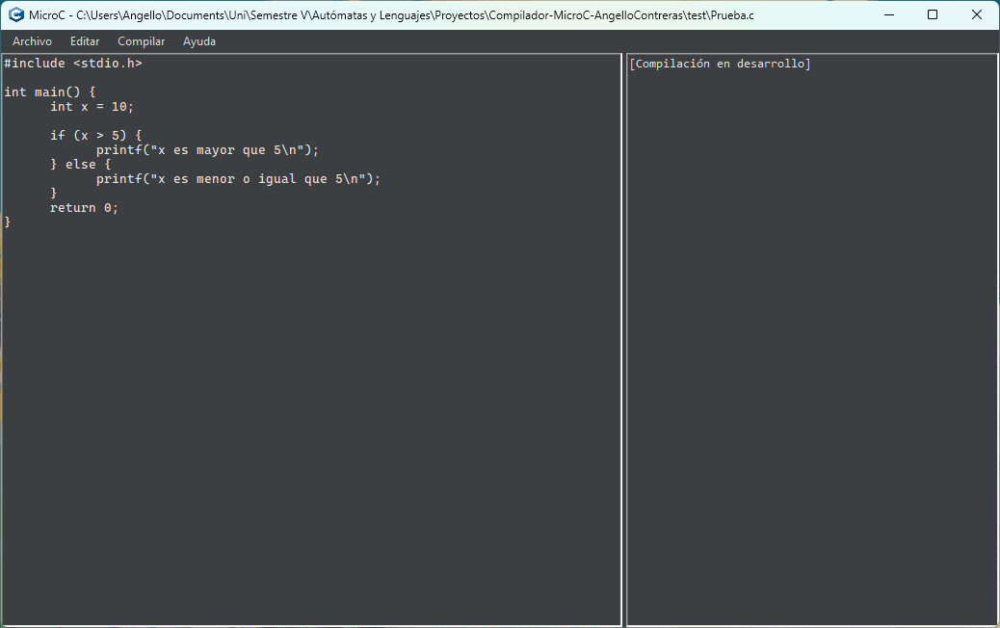

#  Manual de Usuario - Compilador MicroC

Bienvenido al manual de uso del entorno de desarrollo para el Compilador MicroC. A continuación, se detallan las funciones de la interfaz.

##  Interfaz Principal
La interfaz cuenta con un diseño oscuro (Dark Mode) para reducir la fatiga visual. Se divide en dos áreas principales:
1. **Editor de Código:** El área izquierda para escribir y editar el código fuente (`*.c`).
2. **Consola de Salida:** El área derecha que mostrará los resultados de la compilación y mensajes del sistema.

##  Funciones del Menú Archivo
* **Nuevo:** Limpia el editor de código, preparándolo para escribir un nuevo programa desde cero.
* **Abrir:** Despliega un explorador de archivos para cargar un documento de extensión `.c` existente. El código se cargará en modo de solo lectura por seguridad.
* **Guardar:** Si el archivo es nuevo, preguntará dónde guardarlo. Si ya existe, guardará los cambios automáticamente.
* **Salir:** Cierra la aplicación. Si hay cambios sin guardar, el sistema emitirá una alerta de seguridad para evitar pérdida de datos.

##  Funciones de Edición
* **Editar:** Desbloquea el editor de código después de haber abierto un archivo, permitiendo realizar modificaciones al texto.

##  Próximas Funciones (En Desarrollo)
* **Compilar:** Botón reservado para el análisis léxico.
* **Ayuda:** Mostrará información adicional de utilidad.